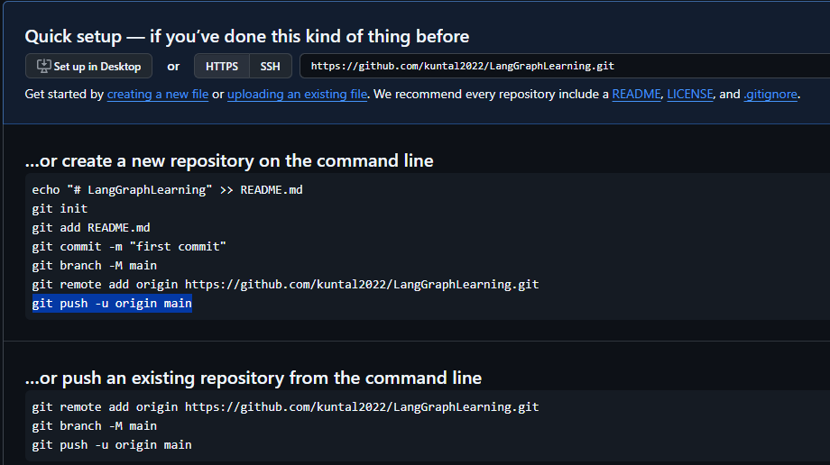

# Install uv
* powershell -ExecutionPolicy ByPass -c "irm https://astral.sh/uv/install.ps1 | iex"
* pip install uv
* uv init
* uv sync

# Create Virtual Environment
* uv venv

# Activate Virtual Environment
* .venv\Scripts\activate

# Add dependencies from requirements.txt
* uv pip install -r requirements.txt

# Kernel for Jupyter
* uv pip install ipykernel
* python -m ipykernel install 

# create a new repository on the command line
* echo "# LangGraphLearning" >> README.md
* git init
* git add README.md
* git commit -m "first commit"
* git branch -M main
* git remote add origin https://github.com/<GitHub_UserName>/<RepositoryName>.git
* git push -u origin main

# push an existing repository to github from the command line
* git remote add origin https://github.com/<GitHub_UserName>/<RepositoryName>.git
* git branch -M main
* git push -u origin main

# --------------------------

